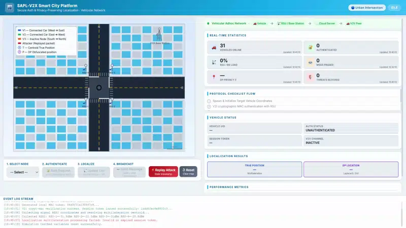

# Secure Authentication and Privacy-Preserving Localization for V2X Communications in Next-Generation Vehicular Networks

[](#)

This repository contains the backend simulation implementation for the paper:
> **Secure Authentication and Privacy-Preserving Localization for V2X Communications in Next-Generation Vehicular Networks**
> 
> *Accepted at the **Ninth International Balkan Conference on Communications and Networking (BalkanCom 2026)**, Ulcinj, Montenegro, June 16-19, 2026.*

### Authors
**Muhammad Jamil**<sup>1,2</sup>, **Adnan Kavak**<sup>1,2</sup>, **Sema Bayraktar**<sup>2</sup>, **Günay Aslan**<sup>2</sup>, **Cansu Canbolat**<sup>1</sup>

<sup>1</sup>*Department of Computer Engineering, Kocaeli University, Kocaeli, Turkey*  
<sup>2</sup>*Wireless Information and Intelligent Systems (WINS) Research Center, Kocaeli University, Kocaeli, Turkey*

---

<p align="center">
  <a href="public/simulator.mp4">
    
  </a>
</p>

## Overview

The simulation handles the following key functionalities:
1. **Hash-Based MAC Authentication**: Secure communication via MAC computation ($MAC = H(K \| m \| T_s \| \text{Seq})$).
2. **V2I Authentication**: 4-Phase secure registration and session token provisioning.
3. **V2V Authentication**: Mutual challenge-response protocol using shared group keys ($K_G$) and derivation of session keys ($K_{session}$).
4. **Replay Protection**: Validation of request freshness across a $\Delta T = 5s$ window.
5. **Distance Estimation**: Log-Distance Path Loss model calculations ($d = 10^{(P_t - RSSI) / (10 \gamma)}$).
6. **Multilateration**: 2D coordinate estimation from multiple authenticated signal sources.
7. **Differential Privacy**: Obfuscation of exact locations by applying Laplace Noise ($L_{dp} = L_{true} + \text{Laplace}(0, S/\varepsilon)$).

## Project Setup

1. Copy `.env.example` to `.env` and configure your local MySQL database.
   ```
   DB_CONNECTION=mysql
   DB_HOST=127.0.0.1
   DB_PORT=3306
   DB_DATABASE=sapl_v2x_paper
   DB_USERNAME=root
   DB_PASSWORD=root
   ```
2. Run database migrations and seeders to populate initial Roadside Units (RSUs).
   ```bash
   php artisan migrate:fresh --seed
   ```
3. Start the Laravel development server.
   ```bash
   php artisan serve
   ```

## Running the Simulation

A built-in simulator view is available to automatically run through the registration, authentication, and localization requests.

1. Navigate to `http://localhost:8000/simulator`.
2. Click **Run Simulation**.
3. Performance metrics (transfer start times and total execution times) are generated and stored in `storage/logs/performance_metrics.json`.

These metrics match the requirements for the "Results and Discussion" section of the paper, enabling latency analysis of the cryptographic and localization services.

## Simulation Results

As presented in the paper, the API-level latency measurements demonstrate high efficiency and low communication overhead under repeated requests due to connection/session reuse:

### V2I Scenario Latency Improvement
- **Authentication Transfer Start Time**: Decreases from **71.38 ms** to **65.02 ms**
- **Authentication Download Time**: Improves from **8.24 ms** to **2.37 ms**

### V2V Scenario Latency Improvement
- **Authentication Transfer Start Time**: Decreases from **67.19 ms** to **32.26 ms**
- **Localization Transfer Start Time**: Reduces from **62.03 ms** to **18.84 ms**

These experimental results show that the proposed methods achieve lightweight and efficient communication performance suited for 6G vehicular applications.

## Citation

If you find this research or code useful, please cite our paper:

```bibtex
@inproceedings{jamil2026secure,
  title={Secure Authentication and Privacy-Preserving Localization for V2X Communications in Next-Generation Vehicular Networks},
  author={Jamil, Muhammad and Kavak, Adnan and Bayraktar, Sema and Aslan, G{\"u}nay and Canbolat, Cansu},
  booktitle={Ninth International Balkan Conference on Communications and Networking (BalkanCom)},
  address={Ulcinj, Montenegro},
  month={June},
  year={2026}
}
```

